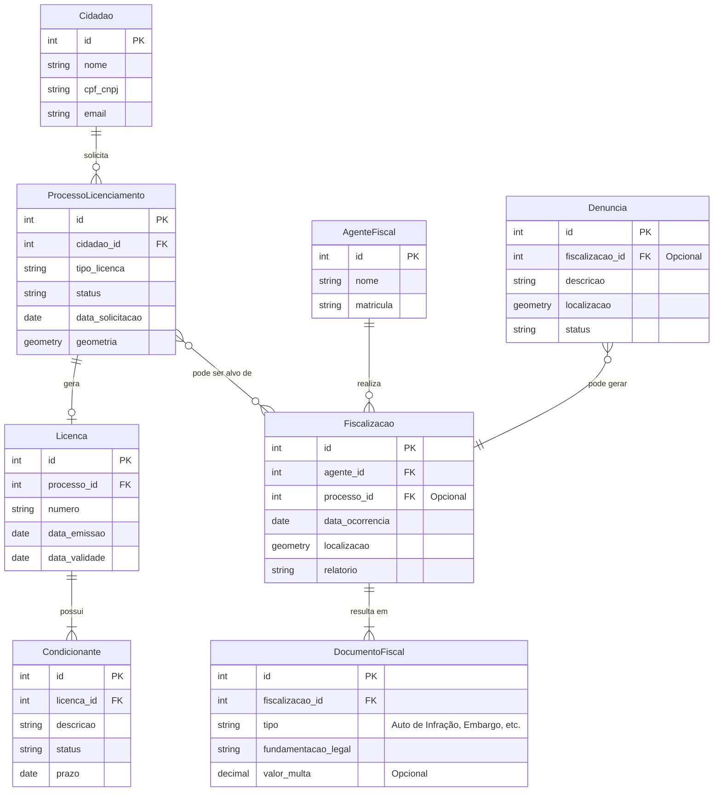
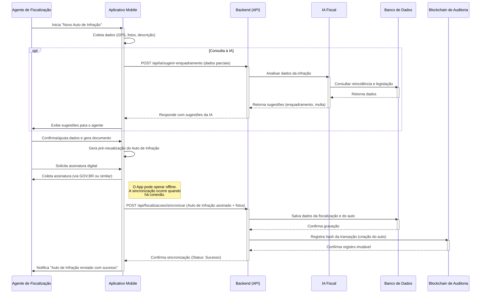
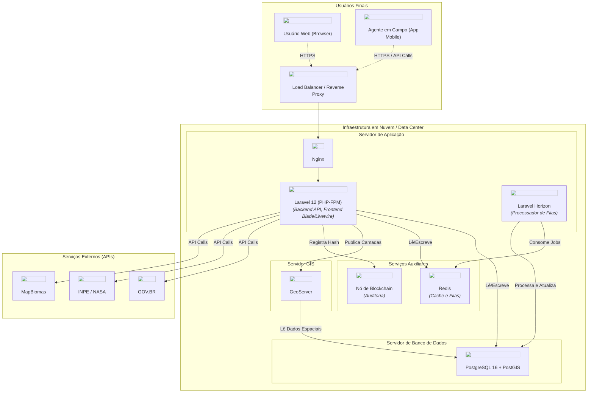
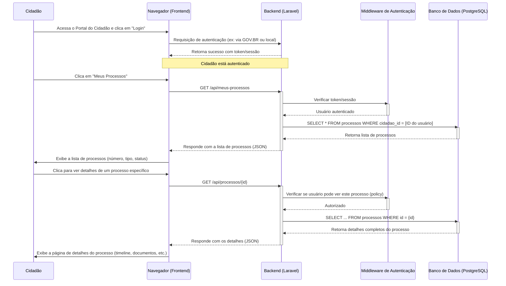

# 📊 Diagramas da Arquitetura e Fluxos do SEMARH Fiscaliza 1.0

Este documento consolida os principais diagramas que representam a arquitetura, os fluxos e as interações do sistema **SEMARH Fiscaliza 1.0**, conforme descrito no `README.md`.

Os diagramas foram gerados utilizando a sintaxe Mermaid e podem ser renderizados em qualquer visualizador de Markdown compatível (como GitHub, GitLab, VS Code, ou editores online).

---

## 1. Diagrama de Contexto do Sistema (Modelo C4 - Nível 1)

Este diagrama oferece uma visão de alto nível do sistema `SEMARH Fiscaliza`, mostrando como os diferentes usuários (atores) e sistemas externos interagem com ele.

```mermaid
graph TD
    subgraph "Atores Externos"
        cidadao[Cidadão]
        agente[Agente de Fiscalização]
        analista[Analista Ambiental]
        gestor[Gestor Público]
    end

    subgraph "SEMARH Fiscaliza 1.0"
        sistema(Sistema SEMARH Fiscaliza)
    end

    subgraph "Sistemas Externos"
        govbr[GOV.BR]
        inpe[INPE / NASA FIRMS]
        mapbiomas[MapBiomas]
        sicar[SICAR]
        outros_sistemas[Outros Sistemas<br/>(Tributação, Obras, etc.)]
        icp[ICP-Brasil]
    end

    %% Interações dos Atores
    cidadao -- "Solicita licenças, consulta processos" --> sistema
    agente -- "Usa App Mobile, registra fiscalizações" --> sistema
    analista -- "Analisa processos, emite pareceres" --> sistema
    gestor -- "Acessa Dashboards de BI" --> sistema

    %% Interações com Sistemas Externos
    sistema -- "Autenticação e Assinatura Digital" --> govbr
    sistema -- "Autenticação e Assinatura Digital" --> icp
    sistema -- "Consome dados de queimadas e monitoramento" --> inpe
    sistema -- "Consome camadas de mapeamento" --> mapbiomas
    sistema -- "Consulta Cadastro Ambiental Rural" --> sicar
    sistema -- "Integra com sistemas municipais" --> outros_sistemas
```

---

## 2. Diagrama de Contêineres (Modelo C4 - Nível 2)

Este diagrama detalha a arquitetura tecnológica do sistema, mostrando os principais "contêineres" (aplicações, bancos de dados, etc.) que compõem o `SEMARH Fiscaliza`.

```mermaid
graph TD
    subgraph "Usuários"
        browser[Usuário via<br/>Navegador Web]
        mobile_user[Fiscal em Campo via<br/>App Mobile]
    end

    subgraph "Ecossistema SEMARH Fiscaliza"
        subgraph "Aplicação Web"
            frontend[Frontend<br/>(Blade, Livewire, Alpine.js)]
            backend[Backend API<br/>(Laravel 12 / PHP 8.3)]
        end

        subgraph "Armazenamento de Dados"
            db[(Banco de Dados<br/>PostgreSQL 16 + PostGIS)]
            redis[(Redis<br/>Filas e Cache)]
        end

        subgraph "Serviços de Geo"
            geoserver[GeoServer]
        end

        subgraph "Processamento Assíncrono"
            worker[Background Worker<br/>(Laravel Horizon)]
        end

        mobile_app[Aplicativo Mobile<br/>(Android/iOS)]
    end

    %% Conexões
    browser -- "HTTPS" --> frontend
    frontend -- "Interage com" --> backend
    mobile_user -- "HTTPS" --> mobile_app
    mobile_app -- "API REST" --> backend

    backend -- "Lê/Escreve" --> db
    backend -- "Usa" --> redis
    backend -- "Envia jobs para" --> worker
    worker -- "Processa e atualiza" --> db
    backend -- "Consulta/Publica" --> geoserver
    geoserver -- "Lê dados espaciais de" --> db
```

---

## 3. Diagrama de Componentes do Backend

Este diagrama foca no contêiner "Backend" e o divide em seus principais componentes lógicos, conforme descrito nas funcionalidades do `README.md`.

```mermaid
graph TD
    subgraph "Backend (Laravel 12)"
        A(API Controller)

        subgraph "Módulos Principais"
            B[Licenciamento]
            C[Fiscalização]
            D[Gestão Documental]
            E[Portal do Cidadão]
            F[Business Intelligence]
        end

        subgraph "Módulos de Inteligência"
            G[IA Analista]
            H[IA Fiscal]
            I[IA Jurídica]
        end

        subgraph "Serviços de Suporte"
            J[Autenticação (Sanctum)]
            K[Geoprocessamento]
            L[Assinatura Digital]
            M[Blockchain de Auditoria]
        end
    end

    A --> B
    A --> C
    A --> D
    A --> E
    A --> F

    B -- "Utiliza" --> G
    C -- "Utiliza" --> H
    B & C & D -- "Utiliza" --> I

    B & C & D -- "Utiliza" --> L
    B & C & D & E & F -- "Utiliza" --> M
    B & C & E -- "Utiliza" --> K
    A -- "Protegido por" --> J
```

---

## 4. Diagrama de Caso de Uso

Este diagrama ilustra as principais interações de cada perfil de usuário (ator) com o sistema, ajudando a entender o escopo funcional sob a perspectiva de quem o utiliza.

```mermaid
graph TD
    subgraph "Atores"
        cidadao[Cidadão]
        agente[Agente de Fiscalização]
        analista[Analista Ambiental]
        gestor[Gestor Público]
    end

    subgraph "Casos de Uso do Sistema"
        uc1(Solicitar Licença Ambiental)
        uc2(Consultar Processo)
        uc3(Registrar Denúncia Ambiental)
        uc4(Obter Suporte via Chatbot)
        uc5(Realizar Fiscalização em Campo)
        uc6(Lavrar Documentos Fiscais<br>Auto de Infração, Embargo, etc.)
        uc7(Analisar Processo de Licenciamento)
        uc8(Gerar Pareceres e Relatórios)
        uc9(Utilizar IA de Suporte<br>Analista, Fiscal, Jurídica)
        uc10(Acessar Painel de BI)
        uc11(Monitorar Indicadores ESG)
        uc12(Gerenciar Camadas de Geoprocessamento)
        uc13(Gerenciar Documentos do Sistema)
    end

    %% Conexões dos Atores com os Casos de Uso
    cidadao -- "Interage com" --> uc1
    cidadao -- "Interage com" --> uc2
    cidadao -- "Interage com" --> uc3
    cidadao -- "Interage com" --> uc4

    agente -- "Executa" --> uc5
    agente -- "Executa" --> uc6
    agente -- "Utiliza" --> uc9
    agente -- "Consulta" --> uc12
    agente -- "Gera" --> uc13

    analista -- "Executa" --> uc7
    analista -- "Executa" --> uc8
    analista -- "Utiliza" --> uc9
    analista -- "Consulta" --> uc12
    analista -- "Gera" --> uc13

    gestor -- "Acessa" --> uc10
    gestor -- "Acessa" --> uc11
    gestor -- "Consulta" --> uc12
```



---

## 5. Diagrama de Entidade-Relacionamento (DER)

Este diagrama modela a estrutura lógica do banco de dados para os módulos de **Licenciamento** e **Fiscalização**, mostrando as principais entidades e como elas se conectam.



---

## 6. Diagrama de Fluxo de Licenciamento Ambiental

Este diagrama de atividades ilustra o processo para obtenção das licenças ambientais (LP, LI, LO), conforme a seção `Fluxo de Licenciamento` do README.

```mermaid
graph TD
    start((Início)) --> A{Solicitação de<br/>Licença Prévia (LP)};
    A --> B[Análise de Requisitos<br/>- Viabilidade locacional<br/>- Memorial descritivo<br/>- Documentação];
    B --> C{Decisão};
    C -- "Aprovado" --> D[Emissão da LP];
    C -- "Reprovado" --> E[Comunicação de Pendências];
    E --> A;

    D --> F{Solicitação de<br/>Licença de Instalação (LI)};
    F --> G[Análise de Requisitos<br/>- LP válida<br/>- Projetos ambientais<br/>- Sistemas de controle];
    G --> H{Decisão};
    H -- "Aprovado" --> I[Emissão da LI];
    H -- "Reprovado" --> J[Comunicação de Pendências];
    J --> F;

    I --> K{Solicitação de<br/>Licença de Operação (LO)};
    K --> L[Análise de Requisitos<br/>- LI válida<br/>- Vistoria técnica<br/>- Comprovação de implantação];
    L --> M{Decisão};
    M -- "Aprovado" --> N[Emissão da LO];
    M -- "Reprovado" --> O[Comunicação de Pendências];
    O --> K;

    N --> finish((Fim do Processo));
```

---

## 7. Diagrama de Sequência: Geração de Auto de Infração

Este diagrama mostra a interação entre o Agente de Fiscalização, o Aplicativo Mobile e os componentes do sistema no backend durante a geração de um Auto de Infração Digital.



---

## 8. Diagrama de Implantação (Deployment)

Este diagrama ilustra como os componentes de software são distribuídos e implantados na infraestrutura de hardware ou em contêineres, mostrando a topologia física do sistema.



---

## 9. Diagrama de Sequência: Consulta de Processo pelo Cidadão

Este diagrama ilustra o fluxo de como um cidadão autenticado consulta a lista de seus processos e visualiza os detalhes de um deles no Portal do Cidadão.

